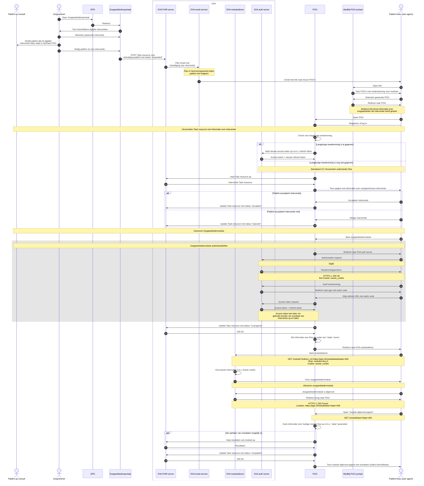

# Zorgaanbiedermodules

Zorgaanbiedermodules zijn modules die vanuit het PGO gestart kunnen worden. In sommige gevallen wordt de patiënt uitgenodigd door de zorgverlener om een modules uit te voeren, in andere gevallen kan de patiënt op eigen initiatief een zelfhelpmodule uitvoeren

## Zorgaanbiedermodules op uitnodiging van de zorgverlener (usecase 1)

In deze flow gaan we er vanuit dat de patiënt op bezoek is bij de zorgverlener die vervolgens via zijn zorgaanbiederportaal een uitnodiging sturt naar de patiënt om bijvoorbeeld een vragenlijst in te vullen. De bedoeling is dat de patiënt deze module vanuit zijn PGO start, via de DVA doorloopt en dat eventuele resultaten uit de interventie zowel bij de zorgverlener in zijn EPD systeem terug te vinden zijn, als in het PGO van de patiënt.

### Voorstel sequence diagram

